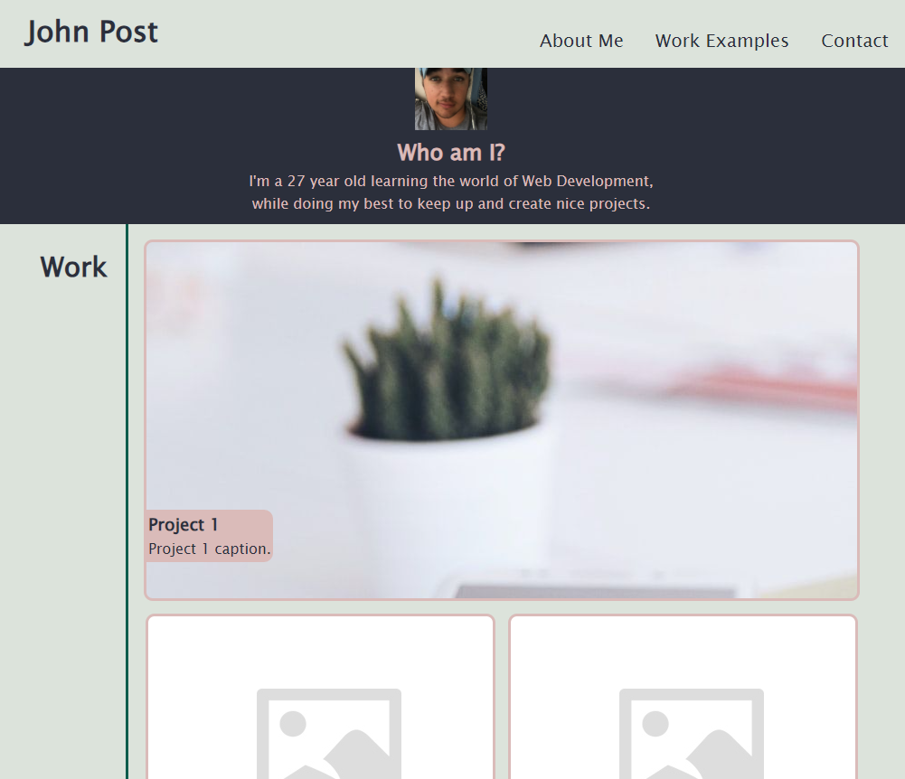

# <Your-Project-Title>

## Description

I designed this webpage to serve as a portfolio for my work that I have created using Web Development.  It will be updated as time goes on to exhibit my completed projects, as well as itself serve as an example of things I have both learned and can apply using HTML,CSS,Javascript, and any future skills i aquire.

## Installation

N/A

## Usage

The navigation bar in the top right links to the different areas of the page and can be used to get to each section quickly.  The small "About me" section should provide any potential employers with a quick summary of who I am as well as any notable achievements of mine.  The main section will present my big project in a larger window than the rest and will act as links to examine those projects more in depth.  The footer links to and lists ways that future potential employers can contact/reach out to me for work.  

## Credits

Tutoring session with Alexis San Javier to solve some flexbox issues.

## License

Please refer to the License document in the repo.
